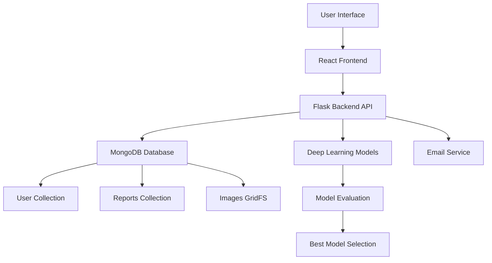

# FractureDetect AI - Project Summary

## Project Overview

FractureDetect AI is a comprehensive medical imaging solution that leverages multiple deep learning models to accurately detect bone fractures in X-ray images. The system provides instant analysis with confidence scoring, medical recommendations, and detailed reporting capabilities.

## Key Features Implemented

### 1. Authentication System
- **User Registration**: Secure signup with patient details
- **User Login**: Traditional email/password authentication
- **OTP Login**: Email-based one-time password verification
- **JWT Tokens**: Secure session management
- **Password Security**: SHA-256 hashing

### 2. Fracture Detection
- **Multi-Model Approach**: 5 different deep learning models
- **Automatic Model Selection**: Best performing model chosen dynamically
- **Real-time Analysis**: Instant fracture detection with confidence scores
- **Body Region Identification**: Automatic detection area classification
- **Medical Recommendations**: Treatment suggestions based on results

### 3. Reporting System
- **PDF Generation**: Professional reports with patient information
- **Visual Formatting**: Color-coded sections and progress indicators
- **Medical Information**: Dietary guidelines and treatment procedures
- **Image Inclusion**: X-ray previews in reports
- **Download Capability**: One-click report saving

### 4. Data Persistence
- **MongoDB Integration**: All data stored in cloud database
- **User Accounts**: Persistent user profiles and preferences
- **Report History**: Complete history of all analyses
- **Image Storage**: Permanent X-ray image storage with GridFS
- **Data Security**: Encrypted storage and secure access

### 5. User Experience
- **Responsive Design**: Works on desktop and mobile devices
- **Intuitive Interface**: Clean, medical-themed UI
- **Progressive Loading**: Smooth user experience
- **Error Handling**: Comprehensive feedback system
- **Navigation**: Easy switching between features

## Technology Stack

### Backend
- **Framework**: Flask (Python)
- **Database**: MongoDB Atlas with GridFS
- **Authentication**: JWT tokens
- **Email**: SMTP integration
- **AI Framework**: PyTorch
- **Deployment**: Local development server

### Frontend
- **Library**: React.js
- **State Management**: Built-in React hooks
- **Styling**: CSS3 with responsive design
- **PDF Generation**: jsPDF library
- **HTTP Client**: Axios

### Deep Learning Models
- **ResNet50**: Convolutional neural network
- **DenseNet121**: Densely connected network
- **EfficientNet**: Efficient scaling architecture
- **FracNet**: Specialized fracture detection
- **MURA**: Musculoskeletal radiograph analysis

## System Architecture



## File Structure

```
Fracture/
├── backend/
│   ├── app.py              # Main Flask application
│   ├── auth.py             # Authentication logic
│   ├── database.py         # MongoDB integration
│   ├── model.py            # Model loading and prediction
│   ├── background_evaluator.py  # Model evaluation
│   ├── requirements.txt    # Python dependencies
│   ├── .env               # Environment variables
│   └── models/            # Deep learning models
├── frontend/
│   ├── src/
│   │   ├── components/
│   │   │   ├── Login.js
│   │   │   ├── Signup.js
│   │   │   ├── History.js
│   │   │   ├── Auth.css
│   │   │   └── History.css
│   │   ├── App.js
│   │   └── App.css
│   └── package.json       # Node dependencies
├── docs/
│   ├── SUMMARY.md         # This document
│   ├── README.md          # Main documentation
│   ├── MONGODB_INTEGRATION.md
│   ├── API_DOCUMENTATION.md
│   ├── FRONTEND_COMPONENTS.md
│   └── MODEL_DOCUMENTATION.md
└── models/                # Deep learning model files
```

## Recent Improvements

### MongoDB Integration
- Replaced in-memory storage with persistent MongoDB database
- User accounts now permanently stored
- All reports and images saved for future reference
- GridFS implementation for efficient image storage

### Enhanced PDF Reports
- Professional formatting with color-coded sections
- Progress bars for confidence visualization
- Improved patient information display
- Better file naming conventions

### Authentication Flow
- Fixed navigation between login/signup pages
- Improved error handling
- Better session management
- OTP system fully functional

### Report History
- New History component for viewing past reports
- Image previews in history listings
- Sortable by date
- Detailed report viewing

## API Endpoints

### Authentication
- `POST /signup` - User registration
- `POST /login` - User authentication
- `POST /send-otp` - Send OTP to email
- `POST /verify-otp` - Verify OTP for login
- `GET /user-details` - Get authenticated user information

### Detection
- `POST /predict` - Analyze X-ray image for fractures
- `POST /chat` - Medical assistant chat
- `POST /find_hospitals` - Find nearby hospitals

### Reports
- `GET /user-reports` - Get all reports for authenticated user
- `GET /report/:id` - Get specific report by ID
- `GET /report-image/:id` - Get X-ray image by ID

## Database Schema

### Users Collection
```javascript
{
  "_id": ObjectId,
  "name": String,
  "email": String,
  "password": String, // Hashed
  "phone": String,
  "age": String,
  "created_at": Date
}
```

### Reports Collection
```javascript
{
  "_id": ObjectId,
  "user_email": String,
  "report_data": Object,
  "image_id": ObjectId, // Reference to GridFS
  "created_at": Date
}
```

## Deployment Instructions

### Backend Setup
1. Install Python dependencies: `pip install -r backend/requirements.txt`
2. Configure environment variables in `backend/.env`
3. Place model files in `models/` directory
4. Start server: `cd backend && python app.py`

### Frontend Setup
1. Install Node dependencies: `cd frontend && npm install`
2. Start development server: `npm start`
3. Access application at `http://localhost:3000`

## Future Enhancements

### Short-term Goals
1. **Performance Optimization**: Model caching and loading improvements
2. **UI/UX Enhancements**: Additional visualizations and animations
3. **Mobile App**: Native mobile application development
4. **Advanced Analytics**: Trend analysis and reporting

### Long-term Vision
1. **Multi-language Support**: Global accessibility
2. **DICOM Integration**: Medical imaging standard support
3. **Radiologist Collaboration**: Expert review workflows
4. **Research Platform**: Data sharing for medical research

## Conclusion

FractureDetect AI represents a significant advancement in medical imaging technology, combining cutting-edge artificial intelligence with user-friendly design to provide accurate, accessible fracture detection. The system's modular architecture and comprehensive documentation make it both powerful and maintainable for future development.